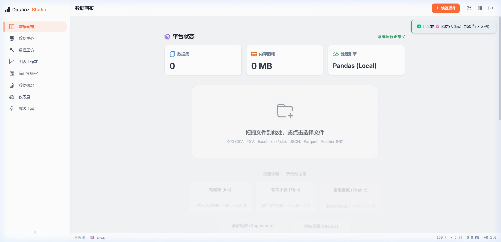
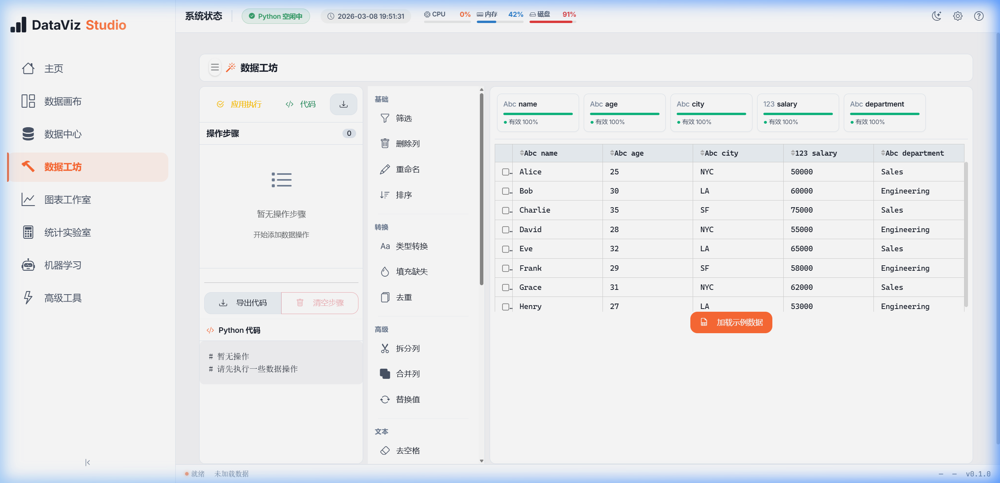
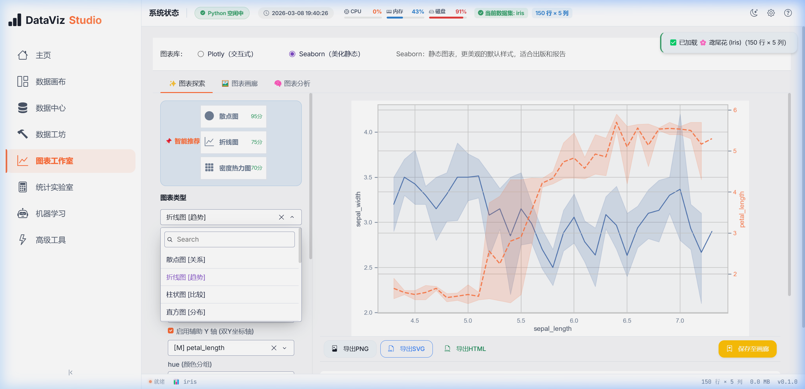

# DataViz Studio

[中文](./README.md) | [English](./README_EN.md)

一个面向数据分析师、数据科学家与业务团队的本地化 Python 低代码数据分析工作台。  
项目基于 Dash、pandas、Plotly 和 scikit-learn，覆盖数据导入、EDA、数据清洗、图表分析、统计分析、机器学习，以及代码与项目导出。

[](https://www.python.org/)
[](https://dash.plotly.com/)
[](https://plotly.com/)
[](LICENSE)

## 最近更新

- 项目持久化恢复：顶栏支持“打开项目 / 保存项目”，可导入导出 `.dvs` 项目文件。
- 页面状态恢复：重新打开项目后，可恢复当前路由、数据集、页面状态和部分分析上下文。
- 统一导出流程：Chart Studio、Data Workshop、Advanced Tools 统一支持导出 `.py` 和 `.ipynb`。
- 顶栏系统状态增强：增加 Python 版本、运行状态、数据集徽标与系统信息展示。
- EDA 与 ML 工作区升级：近期包含数据画布重构、ML Studio 流程增强和若干交互修复。
- 依赖补全：补齐 `requests`、`scipy`、`scikit-learn`、`sqlalchemy`、`kaleido` 等运行依赖。

## 产品预览

| 首页 / 数据总览 | Data Workshop |
| --- | --- |
|  |  |
| Chart Studio | ML Studio |
|  |  |

## 核心能力

### 1. Data Hub

- 支持 CSV、Excel、JSON、Parquet、Feather 等格式。
- 支持本地文件、示例数据、URL / 引用型数据恢复。
- 管理多数据集与当前活跃数据集。

### 2. Data Canvas / EDA

- 提供数据概览、字段结构、导出与分析报告入口。
- 适合快速完成探索式分析与数据质量检查。

### 3. Data Workshop

- 通过可视化步骤完成筛选、排序、缺失值处理、去重、重命名等操作。
- 支持步骤预览、撤销 / 重做、流水线导出。
- 可导出 Python 脚本与 Jupyter Notebook。

### 4. Chart Studio

- 支持 Plotly 与 Seaborn 双引擎。
- 提供图表参数配置、实时预览、PNG / SVG / HTML 导出。
- 生成可复现的 Python 代码与 Notebook 导出内容。

### 5. Statistics Lab

- 提供描述统计、相关性分析、分组汇总和常见统计检验。

### 6. ML Studio

- 覆盖分类、回归、聚类与时序相关流程。
- 支持保存部分页面状态到项目文件，便于继续分析。

### 7. Advanced Tools

- 聚合当前项目上下文，统一导出分析流水线。
- 适合从交互式分析过渡到脚本化交付。

## 最近这几次改动带来的使用变化

### 项目文件 `.dvs`

- 保存时可选择 `embedded` 或 `reference` 两种模式。
- `embedded` 会把数据一起写入项目文件，适合跨机器迁移。
- `reference` 会尽量记录原始来源，适合减小项目体积。

### 顶栏工作流

- 顶栏现在提供项目打开、项目保存、系统状态、数据集徽标和快捷操作入口。
- 系统状态区域会显示 Python 运行状态与版本信息。

### 统一代码导出

- `services/export_service.py` 负责统一构建脚本和 Notebook 导出包。
- Data Workshop、Chart Studio、Advanced Tools 都复用了这一套导出逻辑。

## 技术栈

- Python 3.9+
- Dash
- Plotly
- pandas
- NumPy
- Seaborn / Matplotlib
- SciPy
- scikit-learn
- SQLAlchemy
- Dash Bootstrap Components
- Dash AG Grid

## 安装

```bash
git clone https://github.com/wsyh4567/DATAVIZ-STUDIO.git
cd DATAVIZ-STUDIO
python -m venv venv
```

Windows:

```bash
venv\Scripts\activate
```

macOS / Linux:

```bash
source venv/bin/activate
```

安装依赖：

```bash
pip install -r requirements.txt
```

## 启动

```bash
python app.py
```

默认地址：

```text
http://127.0.0.1:8050
```

## 目录结构

```text
app.py                    Dash 应用入口
components/               顶栏、侧栏、状态栏等复用组件
core/                     数据与状态管理
pages/                    各功能页面
services/                 导入、导出、统计、项目持久化等服务
assets/                   静态资源与截图
tests/                    测试
```

## 适合谁使用

- 需要在本地环境完成分析工作的数据科学家
- 希望用 GUI 加速 pandas / Plotly 工作流的数据分析师
- 需要把交互分析结果导出为 Python 脚本或 Notebook 的团队
- 对数据隐私、本地运行和可复现性有要求的项目

## 当前限制

- 仍以单机本地分析为主，不是多用户协作平台。
- 大数据量场景下仍依赖 pandas 内存模型。
- 部分模块测试覆盖率仍有提升空间。
- 当前文档以快速上手为主，尚未覆盖全部页面细节。

## 开发说明

运行测试：

```bash
pytest
```

如果只验证 Data Workshop 核心执行器：

```bash
pytest tests/data_workshop/test_operation_executor.py
```

## License

MIT
